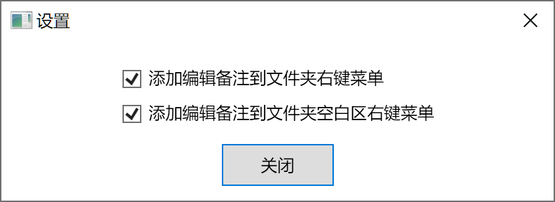
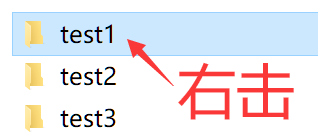
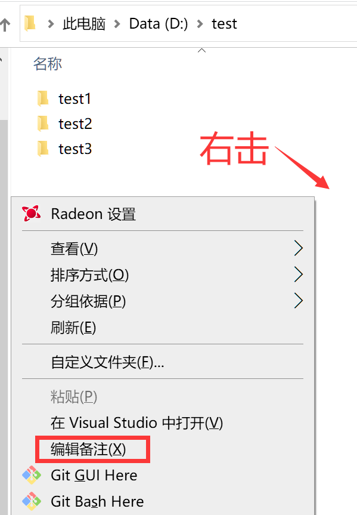
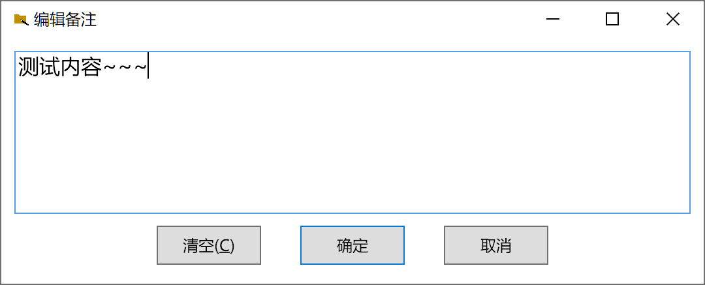

# 使用说明

- 本程序可给文件夹（又称：目录）添加备注，不改变文件夹路径。
- 本程序编辑的是Windows**自带**的文件夹备注，只在Windows下运行。
- 备注储存在对应文件夹的desktop.ini中。故即使关闭备注的显示，或删除本程序，只要不**删除**对应文件夹的desktop.ini（具有隐藏、系统属性），文件夹的备注仍然存在。

## 启用与禁用
- 以管理员身份运行后，弹出**设置窗口**。
**勾选**复选框，则启用成功。若要禁用，**去掉勾选**即可。
仅**启用与禁用**时需要管理员权限写注册表，之后编辑备注均**不需要**。
 
- 文件夹右键菜单：在**右击文件夹**弹出的菜单中，添加一个“编辑备注”菜单，编辑的是被右击的文件夹的备注。
 
 
- 文件夹空白区右键菜单：在右击文件夹**空白区域**弹出的菜单中，添加一个“编辑备注”菜单，编辑的是被右击的文件夹的备注。
 
- 访问键“X”说明：右击鼠标后，直接按**字母X**键即，相当于点击该菜单，免去移动鼠标。

## 编辑备注
- 点击上面两种“编辑备注”菜单，均会弹出**编辑窗口**如下。

- 点击“清空”（或使用访问键Alt+C），则清空**编辑框**内容，但不保存。
- 点击“确定”（或使用回车键Enter），则**保存**当前编辑框内的备注。若编辑框是空的，则清除文件夹的备注。
- 点击“取消”（或按Esc键），则不作任何更改，关闭编辑框。
- 弹出编辑窗口后默认即全选备注文本，因此输入内容后直接按回车键即可完成编辑。结合前面的访问键X，总共只需右击一次鼠标。
- 备注**不支持换行**，并且**首尾**的空格会被**删除**。由于显示内容有限，不建议将备注写太长。

## 显示备注
- 显示备注是Windows自带的功能。除了显示文件夹的备注，还可显示和编辑图片等文件的备注。
- 显示备注需要切换到**详细信息**模式。

- 详细信息默认**没有显示**备注。需要右击任意一列的**顶部标题**，选择“其他”。

向下找到“备注”（大约下拉1~2页），勾选并确定，即可看到右侧的备注。

- 备注列可以**向左拖动**，如排列在名称列右侧，方便观察。
- 备注列支持和名称、修改日期一样的**排序**功能。对于只能识别英文路径的软件，可用备注方法随时添加和修改中文信息，附加在文件夹上，对文件夹绝对路径没有影响。可用以数字打头的备注信息来自定义文件夹的排序顺序。
- 若重命名或移动了已开启详细信息中备注列的文件夹，备注列可能被自动**重新隐藏**，需要使用相同方法再次开启。因此不建议经常重命名详细信息中开启了备注列的文件夹。

