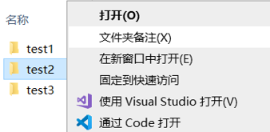

# 文件夹备注

## 功能介绍
- 给文件夹添加Windows**自带**的文件夹备注。入口为文件夹的右键菜单。
- 备注储存在文件夹下隐藏的系统文件desktop.ini中。只要不删除该文件，即使删除本工具，或将文件夹移动到外置磁盘，备注也不会丢失。
- 自动刷新desktop.ini，无需重启Windows资源管理器，也无需手动更改文件夹图标。
- 可任意修改文件夹的修改日期。
- 可将文件夹添加到用户PATH环境变量，或从中移除。
- 所有功能均不需要管理员权限。

## 使用方式
- 从右侧“Release”页面下载exe，放在一个固定的文件夹，并启动，然后**勾选**下方“添加右键菜单‘文件夹备注’”。
- 右击任意文件夹，点击“文件夹备注”或按X键，打开备注编辑窗口，如下两张图片所示。  
  
   
    按Ctrl+Enter或Shift+Enter可以换行。由于显示内容有限，不建议写入太长的备注。
- **手动**开启Windows资源管理器的备注显示。具体步骤如下：
1. 将查看模式切换到**详细信息**。目前仅发现详细信息模式和鼠标悬停时能够显示备注。  

1. 默认情况下**没有显示**备注。需要右击任意一列的**顶部标题**，选择“其他”。  

1. 按两次Page Down按键，在窗口中间找到“备注”，勾选并点击“确定”按钮。此时备注应成功显示。  

## 说明
- 备注列可以**向左拖动**，用于排序和管理。
- 文件夹开启备注列之后，如果被重命名或移动，备注列可能被自动**重新隐藏**，需要使用相同方法再次开启。
- 本工具**只支持文件夹备注**。对于文件备注(元数据)，可自行使用[File Metadata](https://github.com/Dijji/FileMeta)等软件实现，但请注意，有些文件(如txt)本身没有储存备注的功能，使用时需要自行了解其原理，防止**备注丢失**。
- 修改备注时，“修改日期”默认保持不变，但也可自行修改。只要打开或文件夹，则“上次访问日期”就会被**自动更改**，因此本工具在默认将“上次访问日期”设置为与“修改日期”相同。